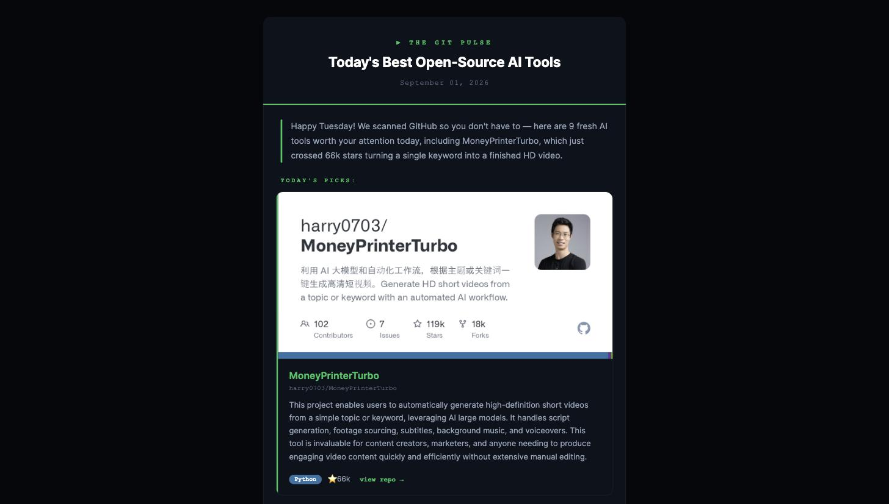

# GitPulse — Daily GitHub AI Tools Digest

A CrewAI multi-agent system that scans GitHub every day for the best new open-source AI tools and delivers a branded HTML email newsletter to your inbox via [Resend](https://resend.com).

---

## Subscribe

GitPulse runs as a live newsletter at **[thegitpulse.com](https://thegitpulse.com)** — register
there to get the digest in your inbox. The crew runs on a schedule **every morning at 9am**,
so a fresh digest lands daily. No setup, no API keys; the rest of this README is for running
your own copy.

---

## Sample output



A real digest produced by this crew — nine repositories found, described, and rendered in
one run. The full email is committed at
[`examples/sample_digest.html`](examples/sample_digest.html); open it in a browser to see
exactly what lands in a subscriber's inbox, before setting up a single API key.

---

## How it works

Three AI agents run in sequence. Each agent hands its output to the next.

```
[Researcher] ──► [Formatter] ──► [Email Reporter]
     │                │                 │
  Searches         Writes           Calls tool
  GitHub,          JSON +           once with
  HN, PH           welcome          all data
                   message
```

### Agent 1 — GitHub AI Tools Researcher

Searches three sources in order:

1. **GitHub Trending** — today and this week, filtered to AI/ML/developer-tools categories
2. **GitHub Search** — `site:github.com AI agent tool`, `LLM framework released`, etc. with recency filters
3. **Hacker News Show HN** and **Product Hunt** — for newly launched tools that link back to a GitHub repo

For every project found it collects: full `github.com` URL, name, owner/repo slug, one-line description, star count, and primary language. Aims for 8–12 distinct repos per run.

**Tools:** `SerperDevTool` (web search) + `GithubSearchTool` (direct GitHub API, if `GITHUB_TOKEN` is set)

---

### Agent 2 — Newsletter Data Formatter

Takes the raw research and produces a single **JSON object** with three keys:

```json
{
  "subject": "SuperMemory just hit 2k stars — and 9 more tools to steal",
  "welcome_message": "Happy Tuesday! We scanned GitHub so you don't have to — here are 10 fresh AI tools worth your attention today, including SuperMemory which just hit 2k stars overnight.",
  "projects": [
    {
      "name": "supermemory",
      "github_url": "https://github.com/supermemoryai/supermemory",
      "owner_repo": "supermemoryai/supermemory",
      "description": "A blazing-fast memory engine built for AI apps...",
      "language": "Python",
      "stars": "2.1k"
    },
    ...
  ]
}
```

Rules enforced by this agent:
- Only projects with a confirmed `https://github.com/owner/repo` URL are included
- Trending topic names or category labels (not specific repos) are discarded
- Output is raw JSON only — no markdown, no code fences, no prose

---

### Agent 3 — Email Reporter

Calls `SendHtmlEmailTool` exactly **once** with the full project list and welcome message. The tool handles everything from that point forward.

---

### The `SendHtmlEmailTool`

Located at [`src/gitpulse/tools/custom_tool.py`](src/gitpulse/tools/custom_tool.py)

What it does on every run, in order:

1. **Coerces** each project dict into a validated `ProjectData` object — handles any type inconsistencies from the agent
2. **Filters** out any project whose URL fails a basic `http/https` validity check
3. **Renders the email** by loading the HTML templates and replacing placeholders
4. **Sends via Resend** as a single broadcast to every contact in your audience
5. **Saves a markdown report** to `reports/` — always, whether the send succeeded or failed, recording the outcome and the broadcast ID

The report filename format: `Daily_GitHub_AI_Tools_Digest_-_YYYY-MM-DD_HH-MM-SS.md`

---

## Email template

The newsletter is rendered from two editable HTML files:

```
src/gitpulse/templates/
├── email_template.html    — full email shell (header, welcome block, footer)
└── project_card.html      — repeated once per repository
```

### How rendering works

The tool does simple string replacement on `{{PLACEHOLDER}}` tokens:

| Template | Placeholder | Filled with |
|---|---|---|
| `email_template.html` | `{{DIGEST_DATE}}` | Today's date, e.g. `June 02, 2026` |
| `email_template.html` | `{{WELCOME_MESSAGE}}` | Agent-generated personalised intro |
| `email_template.html` | `{{PROJECT_CARDS}}` | All rendered card HTML joined together |
| `project_card.html` | `{{PROJECT_NAME}}` | Repository name |
| `project_card.html` | `{{PROJECT_URL}}` | Full GitHub URL |
| `project_card.html` | `{{OG_IMAGE_URL}}` | Auto-generated GitHub preview image (`opengraph.github.com/repo/owner/repo`) |
| `project_card.html` | `{{OWNER_REPO}}` | `owner/repo` slug |
| `project_card.html` | `{{DESCRIPTION}}` | 2–3 sentence project description |
| `project_card.html` | `{{LANGUAGE}}` | Primary language |
| `project_card.html` | `{{LANGUAGE_COLOUR}}` | Hex colour for the language badge |
| `project_card.html` | `{{STARS}}` | Star count |

**GitHub Open Graph images** are fetched automatically — GitHub generates a preview card for every public repo at `https://opengraph.github.com/repo/{owner}/{repo}`. No API key required.

**To customise the design:** edit either template file freely. Only the `{{...}}` tokens must stay in place.

> **One rule:** never put a `{{PLACEHOLDER}}` inside an HTML comment. Rendering is a plain
> string replacement, so a placeholder in a comment gets substituted too — which previously
> caused every project card to be emitted twice and broke the comment open. `tests/` guards
> against this.

---

## Project structure

```
.
├── src/gitpulse/
│   ├── config/
│   │   ├── agents.yaml          — agent roles, goals, backstories
│   │   └── tasks.yaml           — task descriptions and expected outputs
│   ├── templates/
│   │   ├── email_template.html  — email shell (edit to rebrand)
│   │   └── project_card.html    — per-repo card (edit to restyle)
│   ├── tools/
│   │   └── custom_tool.py       — SendHtmlEmailTool: validation, rendering, delivery
│   ├── crew.py                  — agent/task wiring and LLM configuration
│   └── main.py                  — entry point (run / train / replay / test)
├── tests/
│   └── test_custom_tool.py      — rendering, validation and report-writing tests
├── examples/
│   └── sample_digest.html       — a real rendered digest, open in a browser
├── docs/
│   └── sample-digest.jpg        — screenshot used in this README
├── reports/                     — auto-generated markdown reports (gitignored)
├── .env                         — API keys and config (never commit)
└── .env.example                 — copy this to .env and fill in values
```

---

## Setup

### 1. Install dependencies

```bash
uv sync
```

### 2. Configure `.env`

```bash
cp .env.example .env
```

Then fill in each value:

| Variable | Where to get it | Notes |
|---|---|---|
| `LLM_PROVIDER` | — | `google` (default) or `local` for LM Studio |
| `GOOGLE_API_KEY` | [aistudio.google.com/apikey](https://aistudio.google.com/apikey) | Key formats vary (`AIza…`, `AQ.…`) — paste whatever Studio gives you |
| `MODEL` | — | e.g. `gemini/gemini-2.5-flash` |
| `OPENAI_API_KEY` | — | Set to same value as `GOOGLE_API_KEY` |
| `OPENAI_BASE_URL` | — | `https://generativelanguage.googleapis.com/v1beta/openai/` |
| `GITHUB_TOKEN` | [github.com/settings/tokens](https://github.com/settings/tokens) | Classic token, no scopes needed. Optional — falls back to web search only |
| `SERPER_API_KEY` | [serper.dev](https://serper.dev) | Web search for the researcher agent |
| `RESEND_API_KEY` | [resend.com/api-keys](https://resend.com/api-keys) | Free tier, no custom domain needed |
| `RESEND_AUDIENCE_ID` | [resend.com/audiences](https://resend.com/audiences) | **Required.** The digest is broadcast to everyone in this audience |
| `RESEND_FROM_EMAIL` | — | Optional. Defaults to `The Git Pulse <onboarding@resend.dev>`, which needs no domain setup |

> **Why `OPENAI_API_KEY` and `OPENAI_BASE_URL`?**
> `GithubSearchTool` (from `crewai-tools`) checks for `OPENAI_API_KEY` at startup. Setting these to Google AI Studio's OpenAI-compatible endpoint routes those calls through Google instead of requiring a real OpenAI account.

> **Switching to a local model:** set `LLM_PROVIDER=local`, uncomment the LM Studio section in `.env`, and set `BASE_URL`, `MODEL`, and optionally `LM_API_TOKEN`.

### 3. Create a Resend audience

The digest goes out as a **broadcast**, not a direct email, so it needs an audience to send to:

1. Go to [resend.com/audiences](https://resend.com/audiences) and create an audience
2. Add yourself as a contact so you actually receive the run
3. Copy the audience ID into `RESEND_AUDIENCE_ID` in your `.env`

Without this the crew still runs and still writes its report — it just reports that nothing was sent.

---

## Running

```bash
crewai run
```

The crew prints verbose agent output to the terminal, saves a markdown report to `reports/`, and sends the digest as a Resend broadcast to every contact in your audience.

In production GitPulse is deployed to [CrewAI AMP](https://app.crewai.com), where a scheduled
kickoff runs it every morning at 9am and delivers the digest to subscribers automatically —
`crewai run` above is the local equivalent of one of those runs.

A full run typically takes 3–6 minutes depending on how many search iterations the researcher agent needs.

---

## Reports

Every run writes a markdown file to `reports/` regardless of whether the email sent successfully:

```
reports/
└── Daily_GitHub_AI_Tools_Digest_-_2026-06-02_14-30-45.md
```

Each report contains the email delivery status, Resend ID (if sent), and a full list of all projects that were included with their descriptions and links.

---

## Tests

```bash
uv run pytest
```

29 tests covering URL validation, coercion of malformed agent output, template rendering,
and the tool's report-writing paths. No network access and no API keys required — the
renderer and its helpers are pure functions.

---

## Other commands

```bash
crewai train -n 5 -f training.json   # train the crew over multiple iterations
crewai replay -t <task_id>           # replay from a specific task ID
```
